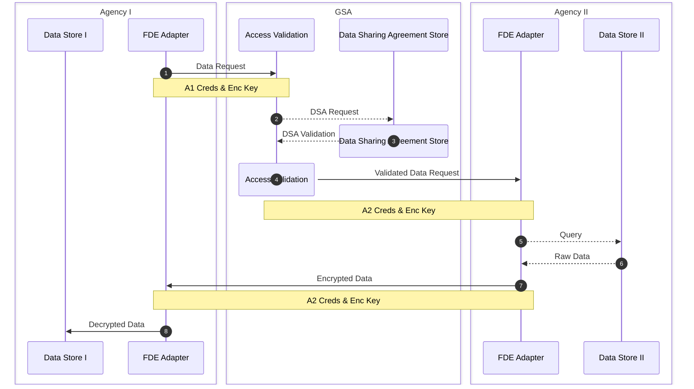

```mermaid
sequenceDiagram
    autonumber
    box Agency I
    participant A1DS1 as Data Store I
    participant A1A as FDE Adapter
    end
    
    box GSA
        participant GAV as Access Validation
        participant GS as Data Sharing Agreement Store
    end
        
    A1A ->> GAV: Data Request
    Note over A1A,GAV: A1 Creds & Enc Key
    GAV -->> GS: DSA Request
    destroy GS
    GS -->> GAV: DSA Validation
    destroy GAV

    GAV ->> A2A: Validated Data Request
    Note over GAV,A2A: A2 Creds & Enc Key

    box Agency II
        participant A2A as FDE Adapter
        participant A2DS2 as Data Store II
    end

    A2A -->> A2DS2: Query
    A2DS2 -->> A2A: Raw Data

    A2A ->> A1A: Encrypted Data
    Note over A2A,A1A: A2 Creds & Enc Key
    A1A ->> A1DS1: Decrypted Data
```