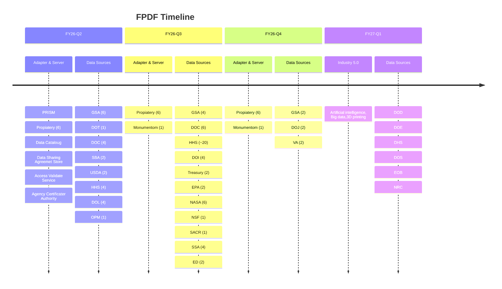
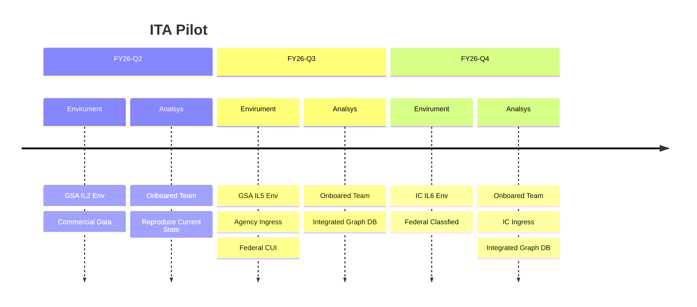

```mermaid 

timeline
	title FPDF Timeline
	section FY26-Q2
		Adapter & Server: PRISM : Propiatery (6) : Data Cataloug : Data Sharing Agreemet Store : Access Validate Service : Agency Certificater Authority
		Data Sources : GSA (6) : DOT (1) : DOC (4) : SBA (2) : USDA (2) : HHS (4) : DOL (4) : OPM (1) 
	section FY26-Q3
		Adapter & Server: Propiatery (6) : Monumentom (1)
		Data Sources : GSA (4) : DOC (6) :  HHS (~20) : DOI (4) : Treasury (2) : EPA (2) : NASA (6) : NSF (1) : SACR (1) : SSA (4) : ED (2)
	section FY26-Q4
		Adapter & Server: Propiatery (6) : Monumentom (1)
		Data Sources : GSA (2) : DOJ (2) : VA (2)
	section FY27-Q1
		Industry 5.0 : Artificial intelligence, Big data,3D printing
		Data Sources : DOD : DOE : DHS : DOS : EOB : NRC
```

```mermaid 
timeline
	title ITA Pilot
	section FY26-Q2
		Envirument : GSA IL2 Env : Commercial Data
		Analsys: Onboared Team : Reproduce Current State
	section FY26-Q3
		Envirument : GSA IL5 Env : Agency Ingress : Federal CUI 
		Analsys: Onboared Team : Integrated Graph DB
	section FY26-Q4
		Envirument : IC IL6 Env : Federal Classfied
		Analsys: Onboared Team : IC Ingress : Integrated Graph DB
	
```